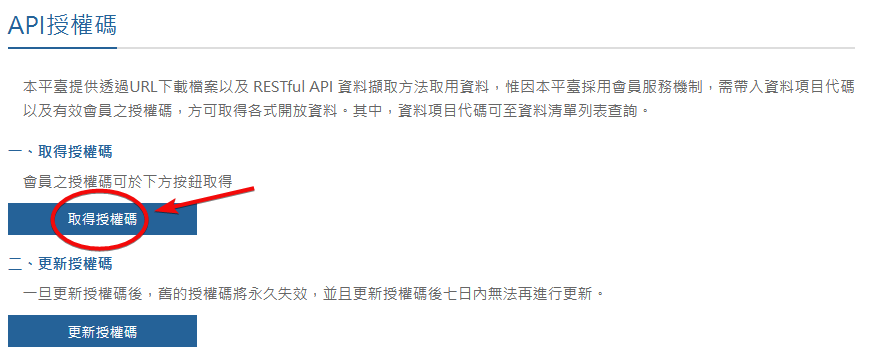

  
  
[English ver.](/docs/README_en.md)

# Taiwan-Weather

Taiwan-Weather 是一個 Home Assistant 的自訂整合，能透過 [中央氣象署 (CWA)](https://opendata.cwa.gov.tw/index) 提供的 API，獲取每小時的天氣預報資訊。

## 使用方法

### 1. 取得 API 金鑰
在 [氣象資料開放平台](https://opendata.cwa.gov.tw/index) 註冊帳號，並取得 [API 金鑰](https://opendata.cwa.gov.tw/user/authkey)。  

### 2. 安裝整合
您可以選擇透過 HACS（推薦）或手動方式安裝此整合。

#### **HACS 安裝 (推薦)**

1. 點擊上方按鈕，將此 Repository 路徑新增至 HACS 中。
2. 在 HACS 搜尋 `Taiwan Weather`，點擊 `Download` 安裝。
3. 重新啟動 Home Assistant 使整合生效。
4. 前往 Home Assistant，依次進入 `設定 > 裝置與服務 > 整合`，點擊右下角 `+ 新增整合`，選擇 `Taiwan Weather`。

#### **手動安裝**
1. 將 `custom_components/taiwan_weather` 資料夾複製到 Home Assistant 的 `config/custom_components` 目錄中。
2. 確保目錄結構為：`config/custom_components/taiwan_weather/`。
3. 重新啟動 Home Assistant 使整合生效。
4. 前往 Home Assistant，依次進入 `設定 > 裝置與服務 > 整合`，點擊右下角 `+ 新增整合`，選擇 `Taiwan Weather`。

### 3. 設定整合
1. 輸入您的 API 金鑰。
2. 選擇縣市並填寫正確的鄉鎮市區名稱（可參考[這裡](/docs/districts_table.md)了解如何取得正確名稱）。
3. 實體名稱選項可自訂該整合的實體名稱，若留空則默認使用鄉鎮市區名稱。

---

這是我首次開發 Home Assistant 整合，仍有許多需要改進的地方，非常期待您的回饋與建議！  
如果您在使用過程中遇到問題或有改進建議，歡迎隨時透過 [Issue](https://github.com/Vinson1014/Taiwan-Weather/issues) 提出。
