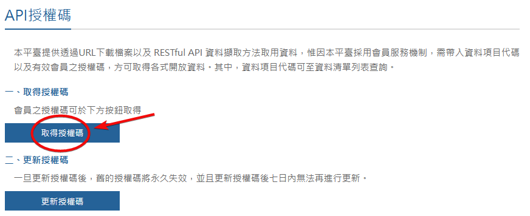
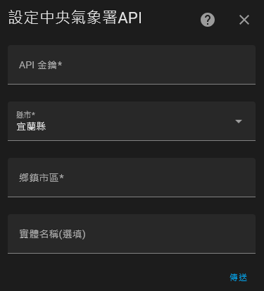

  
  
[繁體中文 ver.](/README.md)

# Taiwan-Weather

Taiwan-Weather is a custom integration for Home Assistant that retrieves accurate weather forecasts via the [Central Weather Administration (CWA)](https://opendata.cwa.gov.tw/index) API.

## Usage Instructions

### 1. Obtain an API Key
Register an account on the [CWA Open Data Platform](https://opendata.cwa.gov.tw/index) and obtain an [API Key](https://opendata.cwa.gov.tw/user/authkey).  

### 2. Install the Integration
You can install this integration via HACS (recommended) or manually.

#### **HACS Installation (Recommended)**

1. Click the button above to add this repository to HACS.
2. Search for `Taiwan Weather` in HACS, then click `Download` to install.
3. Restart Home Assistant to activate the integration.
4. Go to Home Assistant, navigate to `Settings > Devices & Services > Integrations`, click the `+ Add Integration` button in the lower-right corner, and select `Taiwan Weather`.

#### **Manual Installation**
1. Copy the `custom_components/taiwan_weather` folder to your Home Assistant `config/custom_components` directory.
2. Ensure the folder structure is as follows: `config/custom_components/taiwan_weather/`.
3. Restart Home Assistant to activate the integration.
4. Go to Home Assistant, navigate to `Settings > Devices & Services  > Integrations`, click the `+ Add Integration` button in the lower-right corner, and select `Taiwan Weather`.

### 3. Configure the Integration
1. Enter your API Key.
2. Select a city and enter the name of the district/township (must be accurate; refer to [this guide](/docs/districts_table.md) for proper names).
3. The entity name option allows you to customize the entity name of this integration. If left blank, it will default to the district/township name.

---

This is my first attempt at developing a Home Assistant integration, and there is much room for improvement. Your feedback and suggestions are highly welcome!  
If you encounter any issues or have suggestions for improvements, feel free to submit them via the [Issue Tracker](https://github.com/Vinson1014/Taiwan-Weather/issues).
